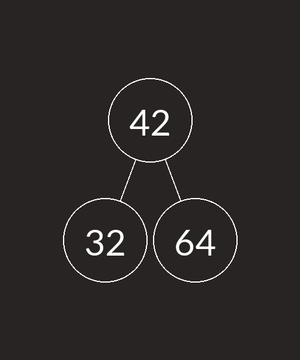
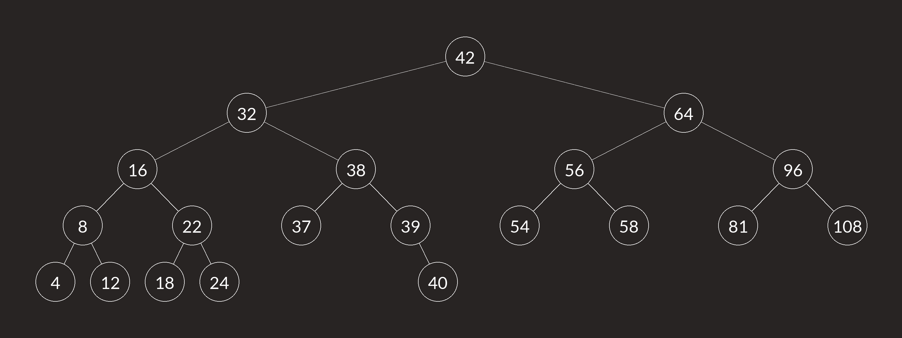

# Tree visualizer
 A visualizer for tree operations. Where you can insert `nodes` with integer values. This can act as a template for students who want to implement tree balancing logic.

## Usage

`h              -   help` 
`*INTEGER*      -   insert integer into the tree` 
`show           -   shows the current tree` 
`save *FILENAME*-   saves an image of the tree. ` 

## Examples
### Three nodes
>   42
>   64
>   32
>   save three_nodes
Output image:  

### Many nodes
>   42
>   64
>   32
>   16
>   8
>   4
>   12
>   56
>   58
>   54
>   38
>   37
>   22
>   18
>   24
>   39
>   40
>   96
>   81
>   108
>   save many_nodes
Output image:  
